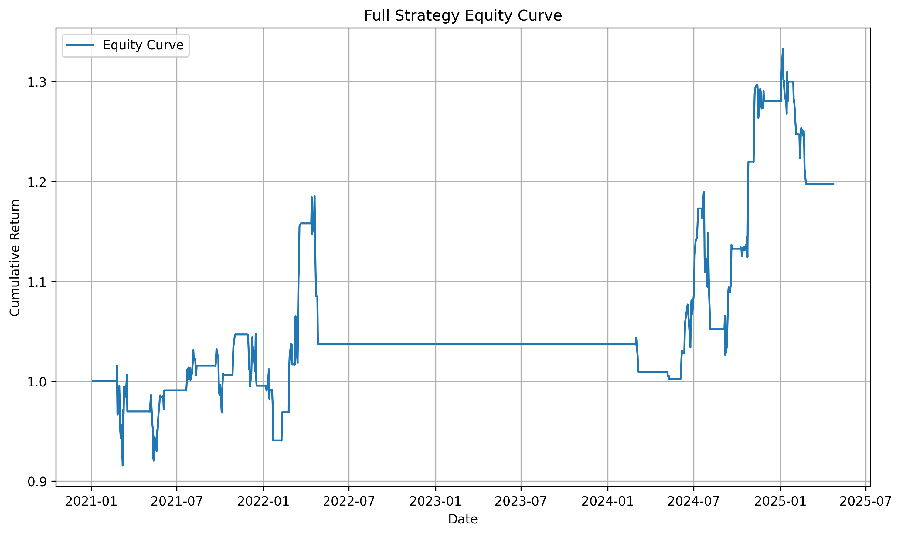
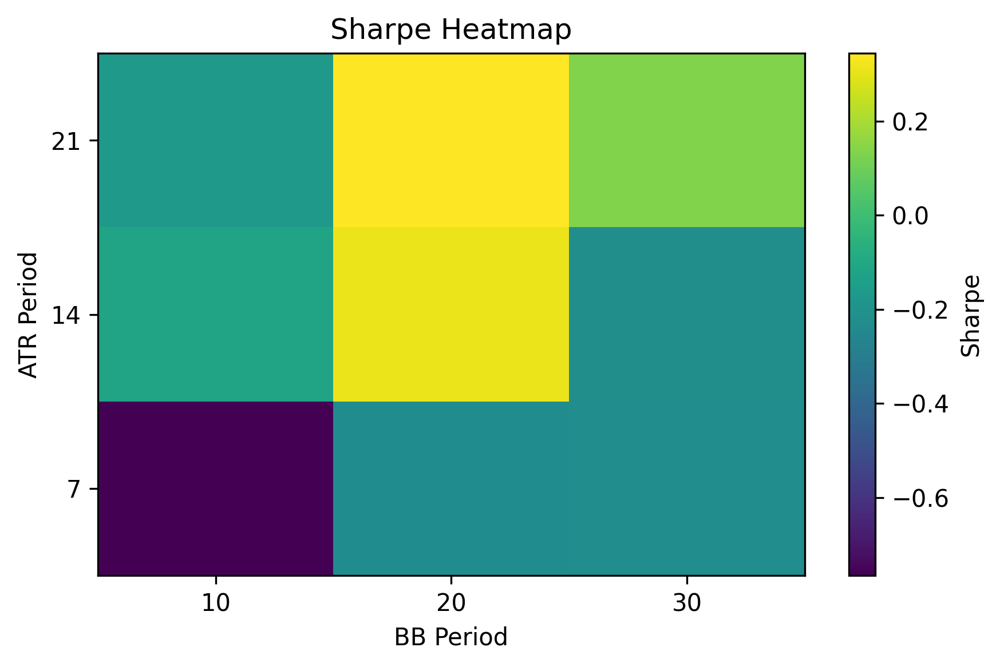

# FIN7053 Final Project  
**Mean-Reversion Swing Strategy on the Magnificent Seven**  
_Author: Tanesh Singhal_

---

## 🔍 Project Overview  
This repository implements and validates a systematic **mean-reversion swing trading** strategy on the “Magnificent Seven” mega-cap stocks:
```
AAPL, MSFT, GOOGL, AMZN, NVDA, META, TSLA
```

**Summary Performance:** Delivered a **4.29%** annualized return with **13.76%** volatility and a **0.31** Sharpe ratio, while capping peak drawdown at **15.49%**.  

Key features:  
- **Entry:** Buy when price dips below the 20-day Bollinger lower band (SMA – 2σ) in a low-volatility regime  
- **Exit:** Stop-loss via 14-day ATR trailing stop or when price reverts above 20-day SMA  
- **Risk Controls:** 30% per-stock concentration cap; 10% drawdown kill-switch (flat for 10 days)  
- **Transaction Costs & Capacity:** Modeled at 2 bps per side; deploy up to 1% of average daily volume  
- **Robustness Checks:** Cost-sensitivity table, parameter-sweep heatmap, 12 m/3 m walk-forward validation

---

## 📂 Repository Structure  
```
FIN7053-final-project/        # Root contains README.md & .gitignore
├── code/                     # Backtest and analysis scripts
│   └── mean_reversion_strategy_FIN7053.py
├── results/                  # Output CSVs & charts
│   ├── capacity_1pct.csv
│   ├── cost_sensitivity.csv
│   ├── heatmap_sharpe.csv
│   ├── oos_monthly_stats.csv
│   ├── equity_curve.png
│   ├── sharpe_heatmap.png
│   └── oos_histogram.png
├── slides/                   # Final presentation deck
│   └── Mean-Reversion-Swing-Strategy-on-the-Magnificent-Seven.pptx
├── requirements.txt          # Python dependencies
├── README.md                 # This file
└── .gitignore                # Excludes __pycache__, data, etc.
```

**Slide Preview:** [Presentation deck](slides/Mean-Reversion-Swing-Strategy-on-the-Magnificent-Seven.pptx)

---

## 🛠️ How to Run the Code  
**Prerequisites:** Python 3.8+  
1. **Clone the repo**  
   ```bash
   git clone https://github.com/yourusername/FIN7053-final-project.git
   cd FIN7053-final-project
   ```  
2. **Install dependencies**  
   ```bash
   pip install -r requirements.txt
   ```  
3. **Set your Alpaca keys**  
   - Edit `code/mean_reversion_strategy_FIN7053.py` with your `API_KEY` and `API_SECRET`.  
4. **Execute the backtest**  
   ```bash
   python code/mean_reversion_strategy_FIN7053.py
   ```  
   Outputs: CSV tables and chart PNGs in `results/`, plus printed metrics.

---

## 📊 Key Results  
**Equity Curve:**  
  

- **Annualized Return:** 4.29%  
- **Annualized Volatility:** 13.76%  
- **Sharpe Ratio:** 0.31  
- **Max Drawdown:** 15.49%  

**Transaction-Cost Sensitivity:**  
| Cost (bps) | Return | Sharpe | Max DD  |  
|----------:|-------:|-------:|--------:|  
| 2         | 4.29%  | 0.31   | 15.49%  |  
| 5         | 4.60%  | 0.34   | 13.85%  |  
| 10        | 0.78%  | 0.06   | 17.16%  |  
| 20        | –4.73% | –0.40  | 24.91%  |  

**Parameter-Sensitivity Heatmap:**  
  

| ATR \ BB | 10     | 20      | 30      |  
|---------:|:------:|:-------:|:-------:|  
| **7**    | –0.77  | –0.23   | –0.22   |  
| **14**   | –0.12  | **0.31**| –0.22   |  
| **21**   | –0.16  | **0.34**| 0.14    |  

**Walk-Forward (12 m/3 m) OOS Monthly Returns:**  
  
- **Mean:** 1.47% | **Std:** 5.86% | **Min:** –8.38% | **Max:** 11.65%  
- **% Positive Months:** 33.33%  

---

## ⚠️ Drawbacks & Limitations  
- **Survivorship Bias:** Static universe excludes delistings.  
- **Look-Ahead Bias:** Signals lagged by one day; intraday edges not captured.  
- **Corporate Actions:** Relies on Alpaca’s raw-adjusted data—dividends/splits may not be precise.  
- **Slippage & Market Impact:** Only fixed 2 bps cost; real-world slippage can vary.  
- **Parameter Risk:** Default parameters robust locally, but risk of overfitting remains.  
- **Market Scope:** Tested solely on U.S. mega-caps—may not generalize to other sectors/markets.  
- **Statistical Confidence:** Limited walk-forward folds; further Monte Carlo simulation recommended.

---

## 🔍 Next Steps  
- Broaden universe (mid-caps, sector ETFs)  
- Add macro regime filters (e.g., SPY 200-day SMA)  
- Monte Carlo / bootstrap for Sharpe ratio confidence intervals  
- CI & unit tests via GitHub Actions to ensure reproducibility  
- Live implementation: slippage, latency, and order-routing modeling

---

## 📄 License  
For academic use only.  

